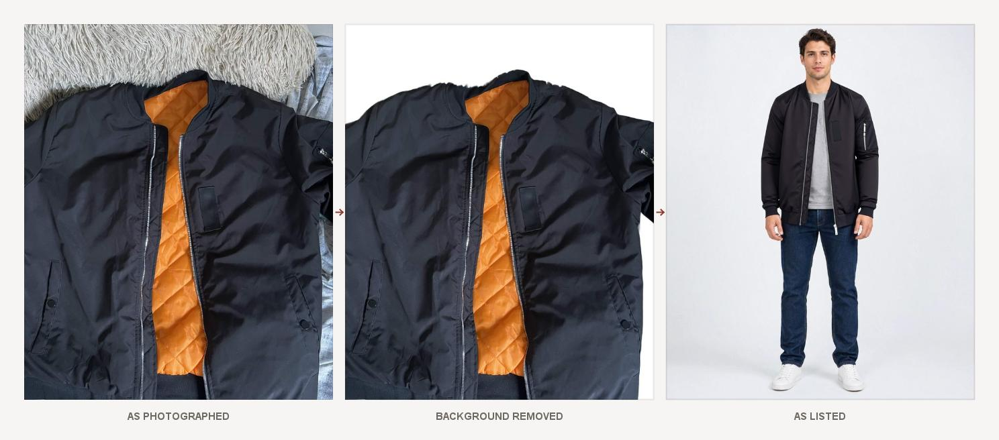
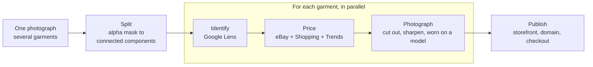
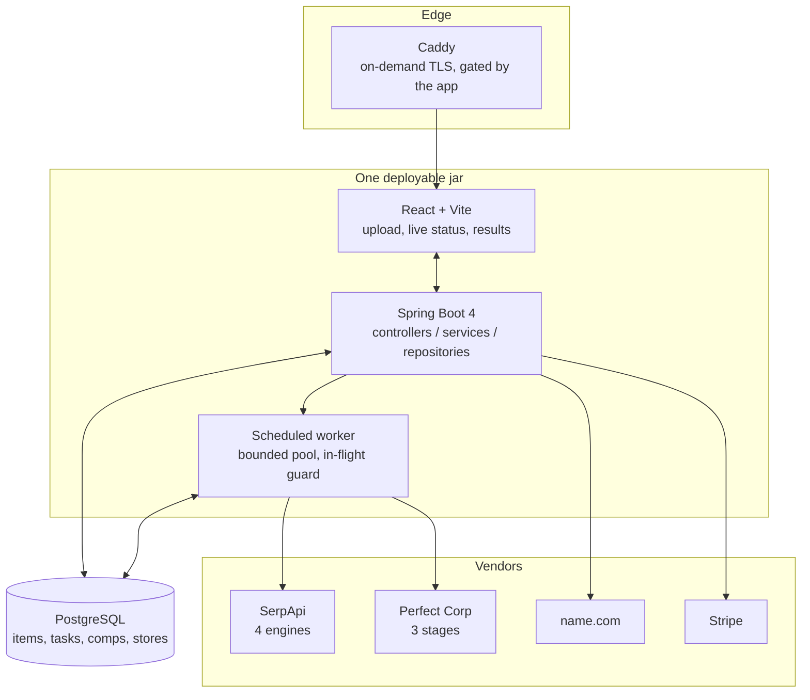

<div align="center">

# Rack

### Photograph the pile. Every piece priced, shot on a model, and listed on a domain you own.

[](https://rackai.store)




</div>

Lay several garments out, take **one** photograph, and Rack finds each piece in it, identifies them,
prices every one from **comparable listings you can click and verify**, produces catalog-quality
photography without a studio or a model, writes the listings, and publishes them to a storefront
with checkout attached — on a domain registered through the name.com API.

**One photo of two garments produces two finished listings in about 40 seconds**, which is what a
single garment costs. The second piece is nearly free, and that is the whole difference between a
listing tool and emptying a closet.

Built for the **DevNetwork [API + Cloud + AI] Hackathon 2026**.

---

## Contents

[The rule](#the-rule-this-project-is-built-on) ·
[How it works](#how-it-works) ·
[Engineering highlights](#engineering-highlights) ·
[Architecture](#architecture) ·
[Vendor integrations](#vendor-integrations) ·
[Running it](#running-it) ·
[Known limits](#known-limits)

---

## The problem

Listing friction, not willingness, is the binding constraint on resale.

Depop, Vinted, Poshmark and ThredUp all still make a seller photograph, describe, and price every
item by hand. One listing takes 15–30 minutes done properly, so a closet is an afternoon nobody
has — and roughly 92 million tonnes of textiles go to waste each year while the resale market grows.

Two walls stand in the way, and Rack automates both:

| Wall | What it costs today | What Rack does |
|---|---|---|
| **Pricing** | Manual searching, or an AI guess you cannot check | Median of live comparable listings, every source clickable |
| **Photography** | A product shoot runs $500–$2,000 | Background removal, enhancement, and try-on on a synthetic model |

**Why now:** the fashion try-on APIs that make the photo pipeline possible only shipped this year.

---

## The rule this project is built on

> ### No number shown to a user is ever generated by a language model.

Every price is the median of real listings, computed arithmetically, with each source rendered next
to it as a link you can open. That single constraint decided the data sources, the failure
behaviour, the UI, and what could not be built.

<table>
<tr><th align="left">Deterministic — arithmetic over evidence</th><th align="left">AI — prose only</th></tr>
<tr valign="top"><td>

- Suggested price (median of comparable listings)
- 25th–75th percentile range
- Retail anchor selection
- Demand direction (thresholded slope)
- Category → try-on endpoint routing
- Running inventory total

</td><td>

- Listing title and description
- Store name suggestions
- Brand string normalisation

</td></tr>
</table>

**What the rule forces.** Fewer than four comps and the panel says so rather than projecting
confidence it has not earned. **No** comps and the item is failed rather than listed — Rack will not
photograph or publish something it cannot price.

> **On "comps".** These are *live comparable listings*, not completed sales. eBay moved sold and
> completed listings behind a login in July 2026, after which SerpApi's `show_only=Sold` returns
> zero rows for every query — verified directly against the live API. Rather than quietly relabel
> asking prices as sale prices, every surface says "listings".

---

## How it works



**Splitting the photo needs no object-detection model.** Perfect Corp's background removal returns
an RGBA image whose alpha channel is a mask of everything that is *not* background. Separate
garments are separate islands of opaque pixels in that mask, so finding them is connected-component
labelling over a bitmap: no second vendor, no model, no extra key. Each region is cropped from the
original photo and becomes an ordinary item, which is why the pieces then run the rest of the
pipeline concurrently with each other.

---

## Engineering highlights

The interesting parts of this project are the places where the obvious approach was wrong.

<details open>
<summary><b>A background-removal endpoint used as an object detector</b></summary>
<br>

The multi-garment feature needed segmentation. Instead of adding a vision model, the answer was
already in the alpha channel of a call the pipeline makes anyway. One extra `sod` call per upload
turns "photograph a piece" into "photograph the pile".

Measured, not asserted: **80 pixels of gap in a 2500-pixel photo separates cleanly; zero gap does
not.** Garments that physically touch are one shape in the mask. Eroding the boundary recovers
narrowly joined pieces, and that erosion is attempted *only* when plain labelling already found
nothing to split — so it can add detections but never break a correct single-garment answer.

[`GarmentDetector`](src/main/java/fileidea/rack/intake/GarmentDetector.java)

</details>

<details>
<summary><b>The bug that would have shipped, and why every test passed</b></summary>
<br>

SerpApi's Google Shopping engine returns a flat `extracted_price`. Its eBay engine nests the same
value under `price.extracted`. The parser read the flat field for both, so every eBay row was
silently discarded, the comp list was always empty, the median was always null, and every publish
threw. The pipeline was dead end to end — and the full test suite passed, because the fixture had
been written to match the code instead of captured from the real API.

**A fixture you wrote yourself only proves your code agrees with itself.**

</details>

<details>
<summary><b>Two wrong fixes before the right one</b></summary>
<br>

Google Lens returns a `knowledge_graph` only for catalogued products, and secondhand clothing on an
unmade bed is not one. The fallback picked the word appearing most often across match titles. A real
pair of jeans came back branded **"Solid"**. Colour and fabric words were added to a blocklist; the
same photo then came back **"Long"**.

The second failure is the signal: frequency genuinely cannot distinguish an adjective from a brand,
because descriptors recur across independent listings exactly the way brands do, and every blocked
word just promotes the next one. **The approach was wrong, not incomplete.**

What works is a different kind of evidence — a list of apparel brands checked first, longest name
first so "American Eagle" is not truncated to "American", requiring the name in two independent
listings. Only when nothing is recognised does it fall back to counting, now weighted by position,
because marketplace titles are written brand-first. The same photo now reads **Zara Jeans**, and the
comps improved with it.

[`IdentifyService`](src/main/java/fileidea/rack/identify/IdentifyService.java)

</details>

<details>
<summary><b>A Spring transaction trap where the obvious fix is worse than the bug</b></summary>
<br>

Garment detection is a vendor round trip of several seconds, and it ran inside the transaction that
writes the batch — so every upload held a database connection for its whole duration, capping
concurrent uploads at the pool size for work that touches no database.

The obvious fix, extracting the write into another method on the same class, is a trap:
`@Transactional` is proxy-based, so a method calling an annotated method on `this` bypasses the
proxy and runs **with no transaction at all**. That failure is silent and corrupts data, where the
original merely limits throughput.

The write went into its own bean instead, with the store resolved by id *inside* the transaction
rather than handed in as a detached entity.

[`IntakeWriter`](src/main/java/fileidea/rack/intake/IntakeWriter.java)

</details>

<details>
<summary><b>Measure the artifact you store, not the response you got</b></summary>
<br>

Background removal looked like a no-op. It returns a PNG whose alpha marks the background while the
original pixels stay in the RGB channels underneath, and those bytes were being written straight to
`.jpg` — which has no alpha channel. The mask was discarded on save, the bedspread came back, and
measuring the stored file showed the garment unchanged. The API had worked correctly the whole time.

`ImagingService` composites onto white before storing now. Verified against a live call: 24% of the
returned image is fully transparent and the garment comes back cleanly cut out.

</details>

<details>
<summary><b>Certificates issued on demand, gated by the application</b></summary>
<br>

"Register a domain and your shop is live on it" is only true for arbitrary domains if TLS issuance
is dynamic. Caddy asks the application before issuing a certificate for any hostname, and the app
answers 200 only for a domain some store actually registered — without that gate, anyone could point
a hostname at the IP and burn the ACME rate limit for every real seller.

A custom domain is then served by an internal **forward**, not a redirect: a redirect would bounce
the visitor off the domain the seller registered, undoing the thing they registered it for.

[`CustomDomainFilter`](src/main/java/fileidea/rack/domain/CustomDomainFilter.java)

</details>

---

## Architecture



The React build is written into Spring's static resources, so **a single jar** serves the UI, the
API, the storefront and uploaded images from one origin. One artifact means the version you tested
is the version that runs, and one origin removes an entire class of CORS problem.

**This is not a wrapper around one API call.** A batch of eight items fans out to 30–40 asynchronous
vendor calls, handled as follows:

| Concern | How it is handled |
|---|---|
| Double-charging vendors | Every external call is a row in `tasks` with an **idempotency key** |
| Transient vendor failure | Retry to `PENDING`, capped at four attempts, then `ERROR` |
| Independent work | Item chains dispatched in parallel across a bounded pool, with an in-flight guard |
| Independent questions | The three SerpApi engines run concurrently on virtual threads — 24s → 8.8s |
| Partial failure | Each item is its own chain; a batch settles to `PARTIAL_FAILURE` rather than hanging |
| Slow vendor polling | Exponential backoff from 500ms, capped at 2s, hard 120s ceiling per stage |

### Modules

| Package | Responsibility |
|---|---|
| `intake` | Upload, garment detection, batch creation, image storage |
| `identify` | Google Lens interpretation, brand / type / category extraction |
| `pricing` | Comp retrieval, deduplication, deterministic price computation |
| `imaging` | Perfect Corp pipeline, per-stage feature flags |
| `listing` | Copy generation, storefront rendering |
| `domain` | name.com lifecycle, custom-domain routing, TLS gate |
| `integration/*` | Vendor HTTP clients, image storage |
| `task` | Vendor task orchestration and polling |

---

## Vendor integrations

### SerpApi — four engines, all load-bearing

| Engine | Purpose | Why it matters |
|---|---|---|
| `google_lens` | Brand and garment type from the raw photo | Without it the seller types everything by hand — that *is* the problem |
| `google_shopping` | Current retail price | The anchor: "retails for $98" |
| `ebay` | Live comparable listings | The number that matters, and a non-Google engine |
| `google_trends` | 12-month interest series | "List now" versus "hold" |

Every response is cached to disk by content hash, so development replays instead of re-billing.

> `rack.serpapi.cache-only=true` runs the pipeline offline against previously recorded responses.
> **Never enable it on a deployed instance** — on a cache miss it throws rather than falling back to
> a live search, so any new upload fails.

### Perfect Corp — the photography pipeline, inverted

Everyone uses virtual try-on buyer-side: *see it on you before you buy.* Rack points it at the
seller, who has no model, no studio, and a phone camera in bad light.

| Stage | Service | Purpose |
|---|---|---|
| 0 | `sod` | Foreground mask → **split the photo into garments** |
| 1 | `sod` | Lift each garment off the bedspread |
| 2 | `enhance` | Sharpen and upscale |
| 3 | `cloth-v4` | Render the garment **worn** on a model |

The model is generated with Perfect Corp's **AI Image Generator** (text to image), so no photograph
of a real person exists anywhere in the system and one consistent model runs across a whole shop.

**Two stages were evaluated and cut.** `lighting` raised a black bomber's mean brightness from RGB
(52,53,62) to (126,133,143) — the jacket came back grey, and try-on faithfully rendered the grey
jacket it was handed. `ai-studio` serves themed *portrait* scenes (`female_pink_bunny`,
`male_neon_bokeh`), which stage a person rather than back a flat garment.

Every stage is independently feature-flagged (`rack.imaging.*`) and **fails soft**: a stage that
errors keeps the previous image and the pipeline continues.

### name.com — the full domain lifecycle

`domains:search` → `domains:checkAvailability` → `domains` (register) → `dns/{domain}/records` →
subdomain → `urlForwardings`

> **Honest status.** Search, availability and registration complete against name.com's sandbox and
> the domain appears in the account. The three DNS calls return 404 there, because the sandbox
> registers a domain without provisioning a zone behind it. Same code path, same requests, and they
> land in production. The UI reports a reason **per step** rather than showing six ticks it cannot
> back.

The domain is not a receipt. A hostname resolves to its store, Caddy issues a certificate on demand
through a gated endpoint, and the shop is served at that address. A seller who already owns a domain
can point it here with no registrar call at all.

### Stripe — what makes the domain load-bearing

A domain hosting a catalog is decoration. At publish time Rack creates a Product (with the on-model
render and description), a Price, and a Payment Link per item, so each listing carries a hosted
checkout that **collects the buyer's shipping address** and is restricted to one completed session —
every garment is one of a kind.

Without a key this degrades to "Contact the seller" and the publish still succeeds.

---

## Running it

**Prerequisites:** JDK 25, Node 20+, Docker.

```bash
# 1. Database
docker compose up -d

# 2. Frontend into Spring's static resources
npm --prefix frontend install && npm --prefix frontend run build

# 3. Run
./mvnw spring-boot:run
```

Open <http://localhost:8080>.

**Keys are optional.** Every integration degrades gracefully: no Perfect Corp key and the original
photo becomes the catalog image, no name.com credentials and the storefront serves at a path, no
Stripe and the page shows contact details. Each of those is a tested path, not a hope. Supply keys
as environment variables or a `.env` file in the working directory:

```
RACK_SERPAPI_API_KEY=...
RACK_PERFECTCORP_API_KEY=...
RACK_PERFECTCORP_MODEL_URL=...      # public https URL of a synthetic model image
RACK_NAMECOM_USERNAME=...
RACK_NAMECOM_TOKEN=...
RACK_STRIPE_SECRET_KEY=...
```

### Tests

```bash
./mvnw test
```

**80 tests, none of which need network access.** They pin the exact JSON shape each vendor returns —
including the shapes that differ between engines of the same vendor, which is where the real bugs
turned out to live.

---

## Known limits

Stated because a limit you can measure is more useful than one you discover.

| Limit | Detail |
|---|---|
| **Touching garments** | Two pieces in contact are one shape in the mask and return as one item. 80px of gap in a 2500px photo separates cleanly; zero gap does not. |
| **Brand identification** | A brand outside the recognised list falls back to a positional heuristic and can be wrong. The brand is editable in place, and a correction re-runs pricing and copy. |
| **No auth** | Single-tenant by design for this build. Everything hangs off one store id. |
| **name.com DNS** | Sandbox does not host DNS for test domains; those three calls land only in production. |
| **No cross-posting** | Cut deliberately — the OAuth review cycles alone would have consumed the timeline. |

---

## Repository map

| Path | What's there |
|---|---|
| `src/main/java/fileidea/rack/` | Backend, organised by module |
| `src/test/java/` | 80 tests |
| `src/test/resources/fixtures/` | Recorded vendor responses used by the tests |
| `frontend/` | React + Vite source; builds into Spring's static resources |
| `docs/` | README assets |
| `docker-compose.yml` | Postgres for local development |

---

<div align="center">
<sub><b>Live at <a href="https://rackai.store">rackai.store</a></b> · Built for the DevNetwork [API + Cloud + AI] Hackathon 2026</sub>
</div>
